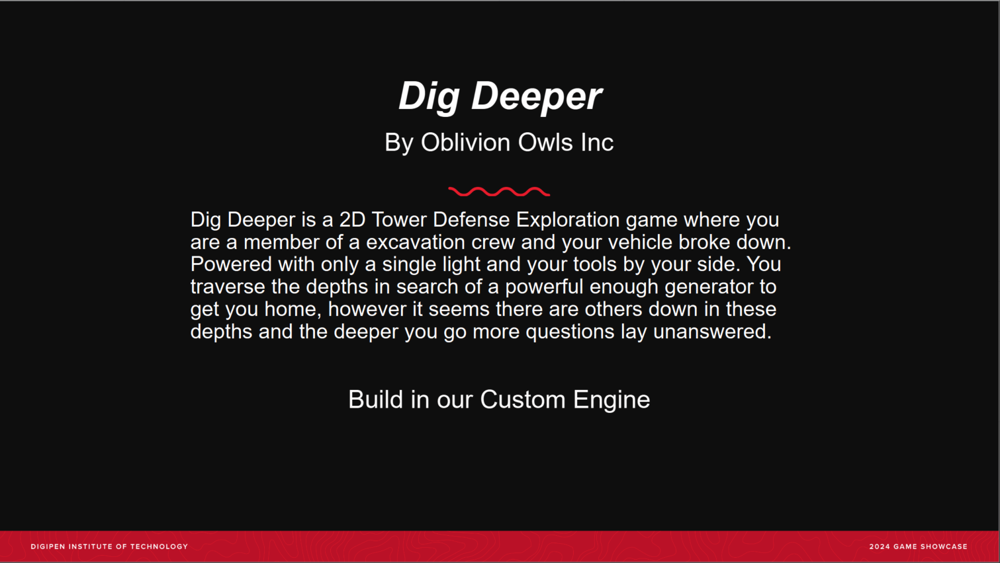

# Project-OWL

## 🎮 Overview
**Dig Deeper** is a **2D Tower Defense Exploration** game created by **Oblivion Owls Inc**.  

You play as a member of an excavation crew whose vehicle has broken down. Armed with only a single light and your tools, you must traverse the depths in search of a powerful enough generator to get you home. But you’re not alone down there—the deeper you go, the more questions remain unanswered.

Built in our **custom game engine**.

---

## Gameplay Video

---

## 👥 Team Credits

###  Production
- **Jax Clayton** — Producer  
- **Kieran McKee** — Associate Producer  

### Leads
- **Steve Bukowinski** — Tech Lead  
- **Ava Arnett** — Design Lead  

###  Programming
- **Jax Clayton** — Editor Programmer  
- **Tyler Birdsall** — Input/Gameplay Programmer  
- **Steve Bukowinski** — Engine Programmer  
- **Eli Tsereteli** — Graphics Programmer  
- **Aidan Straker** — Serialization/Gameplay Programmer  

###  Design
- **Kieran McKee** — Systems Designer  
- **Ethan Volonte** — User Research  
- **Ava Arnett** — UI/UX Designer  
- **Ty Stanley** — Narrative/Level Designer  

###  Art
- **Liv Hermosilla** — Character Artist  
- **Ty Stanley** — Environmental Artist  
- **Kieran McKee** — Props Artist  
- **Ava Arnett** — UI Artist  
- **Ethan Volonte** — UI Artist  
- **Eli Tsereteli** — VFX Artist  

###  Music & Sound
- **Jax Clayton** — Composer  
- **Ava Arnett** — Sound Editor  

###  Faculty and Advisors
- Ellen Beeman — Production Professor  
- Rachel Rutherford — Production Professor  
- Douglas Schilling — Programming Professor  
- Jeremy Holcomb — Design Professor  

###  Special Thanks
- Ben Kurtin  
- Zev Seitz  
- Chris Onorati  
- All DigiPen students and faculty who supported this project  

---

##  Technology
Built with our custom engine using:  
- [FMOD Studio](https://www.fmod.com/)  
- [OpenGL](https://www.opengl.org/)  
- [GLFW](https://www.glfw.org/)  
- [IMGUI](https://github.com/ocornut/imgui)  
- [JSON for Modern C++](https://github.com/nlohmann/json)  
- [GLUT](https://www.opengl.org/resources/libraries/glut/)  

---

##  Created At
DigiPen Institute of Technology  
2024 Game Showcase  

---

## 📜 License
© 2024 Oblivion Owls Inc. / DigiPen (USA) Corporation.  
All rights reserved.